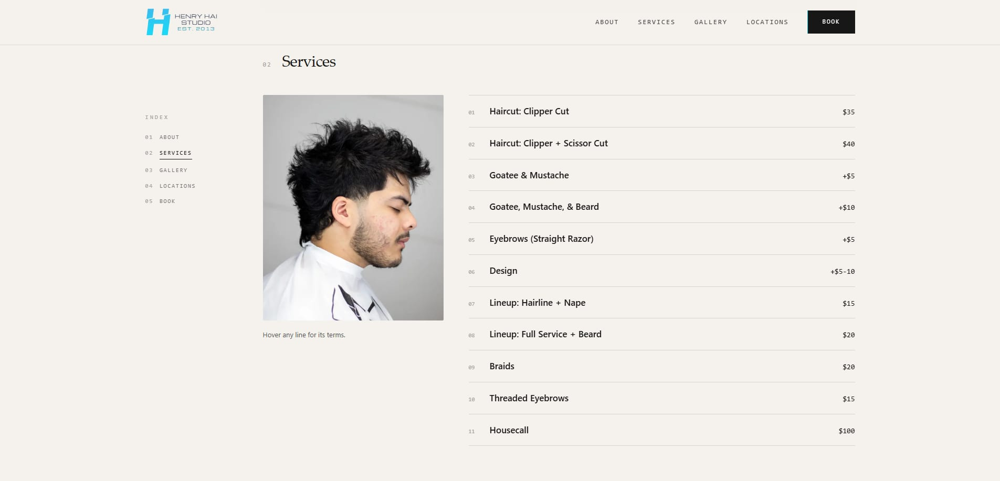
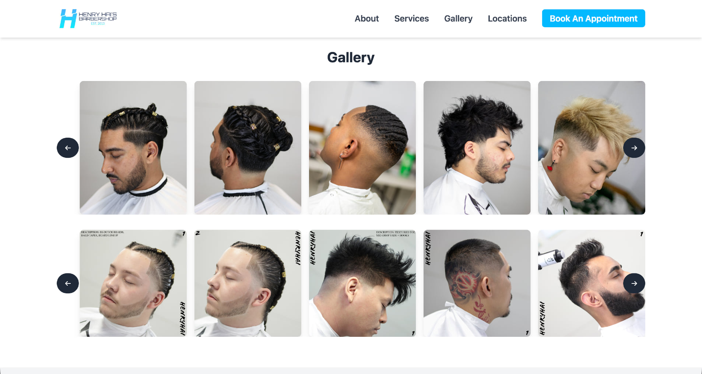
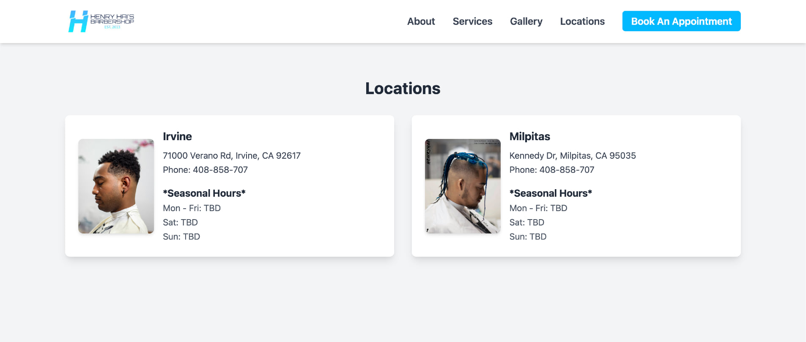
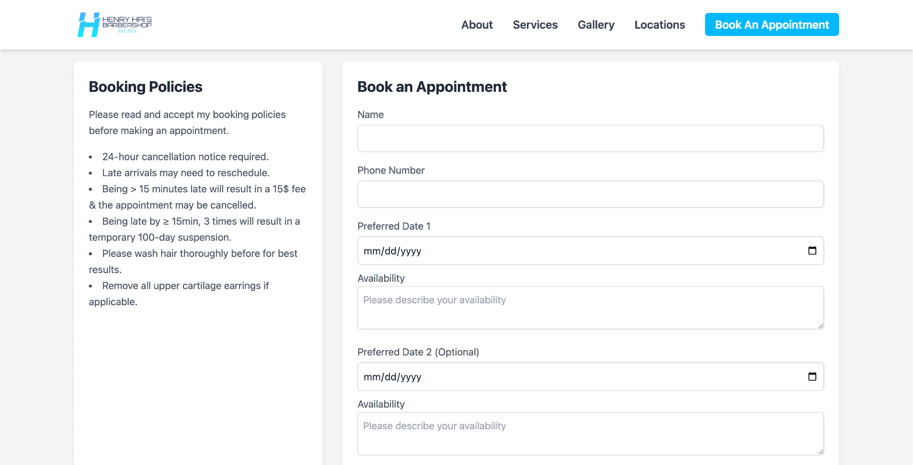
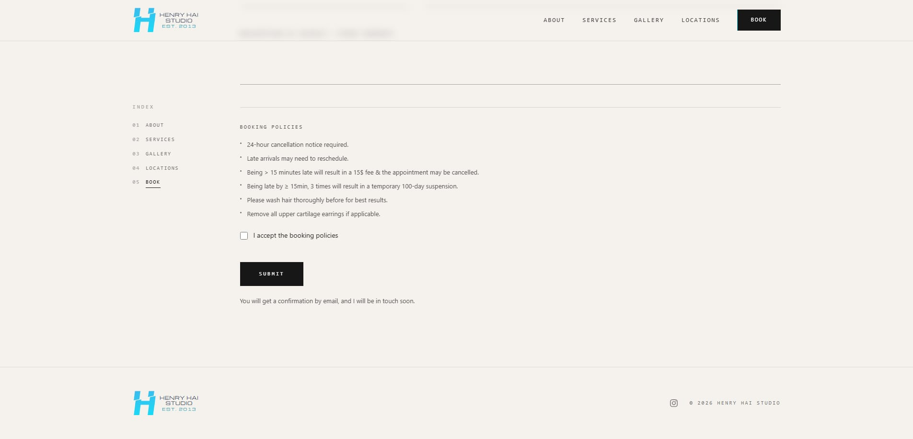
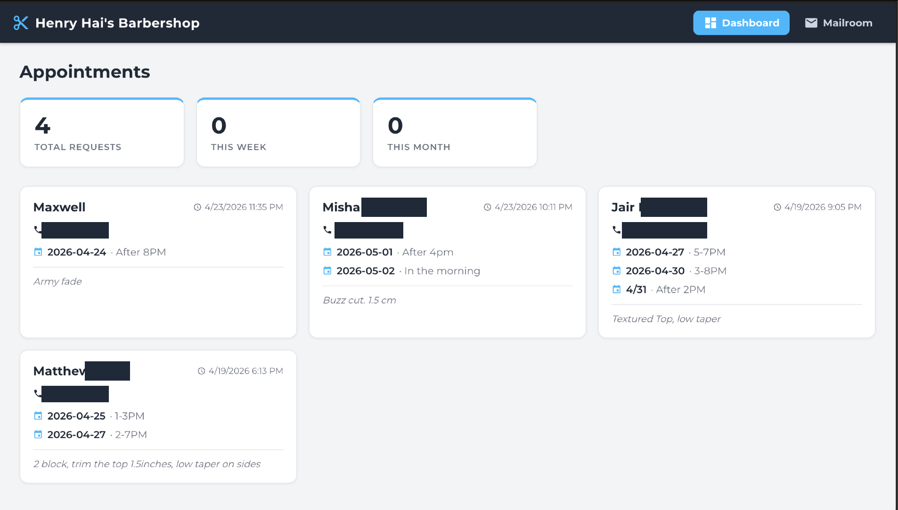

# Barbering Booking Platform

A full-stack barbering booking platform serving 300+ clients, built with React, Node.js, Express, TypeScript, and Webpack. The public site handles appointment requests through EmailJS, with an n8n automation layer that turns booking emails into structured rows in Google Sheets. A separate Express API powers a React app with two views: an **appointments dashboard** that reads the booking data live via the Google Sheets API, and a mail client that uses Gmail over SMTP/IMAP.

## Live static site

The customer-facing barbering site is deployed with **GitHub Pages** from a dedicated static repo:

- **Live site:** [henry-hai.github.io/barber_website/](https://henry-hai.github.io/barber_website/)
- **Source repo:** [github.com/henry-hai/barber_website](https://github.com/henry-hai/barber_website)








## Appointments Dashboard

A React dashboard reads booking requests **live** from the Google Sheet that the n8n workflow appends to, using the Google Sheets API authenticated with a read-only GCP service account. It shows headline stats and a card per request (client name, submitted time, preferred slots, and notes). The booking data stays in Google Sheets as the single source of truth, viewable on a phone, while the dashboard surfaces it inside the app. *(Client phone numbers and last names redacted below.)*



## Architecture

```
Browser  -->  Static Site (index.html, Webpack bundle)
              React Navbar + TypeScript Gallery

Appointment form  -->  EmailJS  -->  inbox notifications
                      |
                      +-->  n8n  -->  Gmail trigger -> JS transform -> Google Sheets

Browser  -->  React SPA (client/)  -->  Express API (server/)  -->  Gmail (SMTP/IMAP)
              Dashboard + Mailroom            |    |
                                              |    +-->  Google Sheets API (service account)
                                          NeDB (contacts)
```

**Root** -- The barbering website: responsive single-page site with a React navbar component, TypeScript gallery modules bundled by Webpack, Tailwind CSS styling, and an EmailJS-powered booking form. An n8n workflow (Gmail trigger → JavaScript transform → Google Sheets append) captures each booking email as a structured row (configured in the n8n editor, not in this repo).

**server/** -- RESTful API built with Node.js and Express. Handles email operations via SMTP (NodeMailer) and IMAP, with an embedded NeDB database for persistent contact storage.

**client/** -- React SPA with Material-UI components and CSS Grid layout, split into two views via a top-bar toggle: an **appointments dashboard** (booking requests + stats from the Google Sheets API) and a **mail client** (mailboxes, messages, and contact CRUD). Communicates with the server via Axios.

## Tech Stack

| Technology | Usage |
|---|---|
| React | Navbar component (root), full SPA (client/) |
| Node.js | Static file server (root), Express API runtime (server/) |
| Express | RESTful API framework |
| TypeScript | Gallery modules (root src/), server API, React client |
| Webpack | Module bundling for TypeScript (root) and React (client/) |
| Tailwind CSS | Responsive utility-first styling |
| Material-UI | React component library (client/) |
| NodeMailer | SMTP email sending |
| NeDB | Embedded document database for contacts |
| Axios | HTTP client for API communication |
| EmailJS | Client-side appointment form: sends booking requests to email |
| n8n | Automation workflow: Gmail trigger → JavaScript transform → Google Sheets |
| Google Sheets API | Reads booking data into the dashboard via a read-only GCP service account |

## Getting Started

### Static Barbering Site

No build step needed to view the site. Start the Node.js server and open in browser:

```bash
npm install
node server.js
```

Visit `http://localhost:3000`. To rebuild the Webpack bundle after editing TypeScript:

```bash
npx webpack
```

### Backend API Server

```bash
cd server
npm install
cp serverInfo.example.json serverInfo.json
```

Edit `serverInfo.json` with your Gmail address and [App Password](https://support.google.com/accounts/answer/185833), then:

```bash
npx tsc
node dist/main.js
```

The API starts on `http://localhost:8080`.

### React Client

```bash
cd client
npm install
npm run build
```

Open `http://localhost:8080` to view the React client (served by the backend).

## API Endpoints

| Method | Endpoint | Description |
|---|---|---|
| GET | `/appointments` | List booking requests from the Google Sheet (newest first) |
| GET | `/mailboxes` | List all mailboxes |
| GET | `/mailboxes/:mailbox` | List messages in a mailbox |
| GET | `/messages/:mailbox/:id` | Get a specific message |
| DELETE | `/messages/:mailbox/:id` | Delete a message |
| POST | `/messages` | Send a new email |
| GET | `/contacts` | List all contacts |
| POST | `/contacts` | Add a contact |
| DELETE | `/contacts/:id` | Delete a contact |

## Project Structure

```
barber-booking/
├── index.html              # Barbering site (React navbar, Tailwind CSS)
├── server.js               # Node.js static file server
├── package.json            # Webpack + TypeScript dependencies
├── tsconfig.json           # TypeScript compiler config
├── webpack.config.js       # Webpack bundler config
├── img/                    # Barbering portfolio photos
├── screenshots/            # README images (static site + dashboard)
├── automation/
│   └── Barber_Log.json     # Exported n8n workflow (Gmail -> JS -> Sheets)
├── src/                    # TypeScript gallery modules
│   ├── index.ts            # Entry point (Webpack starts here)
│   ├── Gallery.ts          # Gallery class (implements IGallery)
│   ├── GalleryRow.ts       # GalleryRow class (implements IGalleryRow)
│   ├── interfaces.ts       # TypeScript interfaces
│   └── utils.ts            # Utility functions
├── server/                 # Express REST API backend
│   ├── src/
│   │   ├── main.ts         # Express app and route definitions
│   │   ├── Appointments.ts # Google Sheets reader (service account)
│   │   ├── SMTP.ts         # NodeMailer email sending
│   │   ├── IMAP.ts         # IMAP email reading
│   │   ├── contacts.ts     # NeDB contact CRUD
│   │   └── ServerInfo.ts   # Config loader
│   ├── package.json
│   ├── tsconfig.json
│   └── serverInfo.example.json
└── client/                 # React SPA frontend
    ├── src/
    │   ├── index.html
    │   ├── css/main.css
    │   └── code/
    │       ├── main.tsx         # React entry point
    │       ├── state.ts         # Centralized state management
    │       ├── config.ts        # Server URL config
    │       ├── theme.ts         # Material-UI theme
    │       ├── Appointments.ts  # Booking request API calls
    │       ├── IMAP.ts          # Mailbox API calls
    │       ├── SMTP.ts          # Send email API calls
    │       ├── Contacts.ts      # Contact API calls
    │       └── components/
    │           ├── AppShell.tsx
    │           ├── Dashboard.tsx
    │           ├── BaseLayout.tsx
    │           ├── Toolbar.tsx
    │           ├── MailboxList.tsx
    │           ├── MessageList.tsx
    │           ├── MessageView.tsx
    │           ├── ContactList.tsx
    │           ├── ContactView.tsx
    │           └── WelcomeView.tsx
    ├── package.json
    ├── tsconfig.json
    └── webpack.config.js
```


